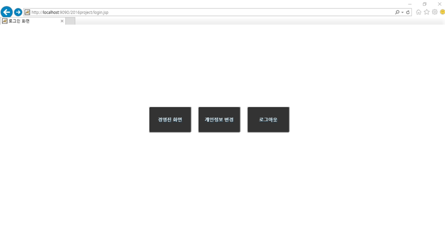
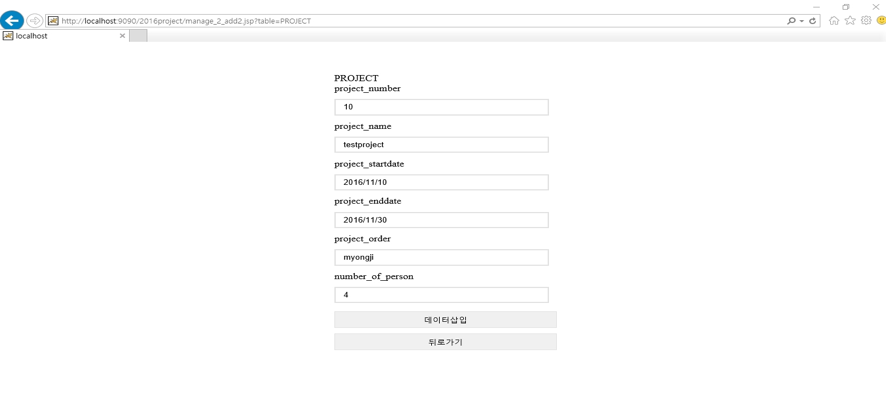
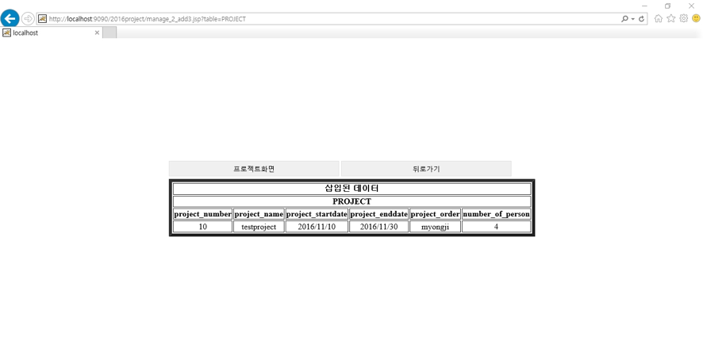
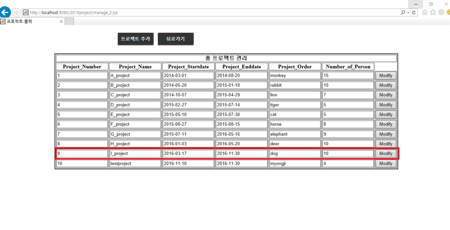
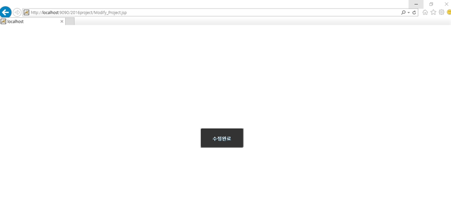

# Database-design

## [경영진 로그인 화면]

  

- 경영진 id로 로그인을 하게 되면, 페이지에 ‘경영진 화면’, ‘개인정보 변경’, ‘로그아웃’ 버튼이 있다.   

## [프로젝트 추가 Form 화면]

  

- ‘프로젝트 추가’ 버튼을 클릭하여 프로젝트 번호, 프로젝트 명, 프로젝트 착수/종료 일자, 발주처, 참여 인원을 입력하여 ‘데이터 삽입’ 버튼을 클릭하게 되면, 프로젝트가 정보가 추가된다. (종료 일자는 입력하지 않아도 가능)  

## [프로젝트 추가 확인 화면]

 

- 추가된 프로젝트 정보를 확인할 수 있고, ‘프로젝트 화면’ 버튼을 클릭하게 되면, 추가된 정보를 포함하여 모든 프로젝트 정보를 확인할 수 있다.  

## [프로젝트 수정 화면]

  

- 수정하고 싶은 정보를 변경하고, 'Modify‘버튼을 클릭하면 해당 프로젝트의 정보를 수정할 수 있다.  

## [프로젝트 수정 알림 화면]  

  

- 경영진 id로 로그인을 하게 되면, 페이지에 ‘경영진 화면’, ‘개인정보 변경’, ‘로그아웃’ 버튼이 있다.

- 추가된 프로젝트 정보를 확인할 수 있고, ‘프로젝트 화면’ 버튼을 클릭하게 되면, 추가된 정보를 포함하여 모든 프로젝트 정보를 확인할 수 있다.

- ‘수정 완료’버튼을 클릭하면 변경된 정보를 포함한 모든 프로젝트 정보를 확인할 수 있다.  

## [로그인 화면]

  

- ‘로그아웃’ 버튼을 클릭하면, 로그인된 아이디가 로그아웃 되고, 로그인 페이지로 돌아간다.  
